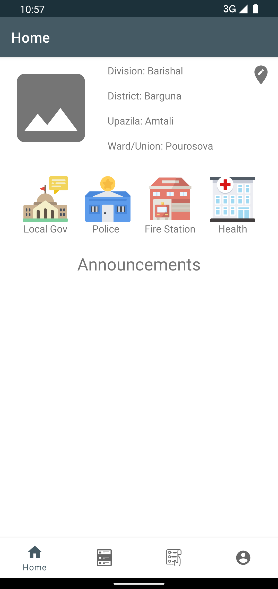
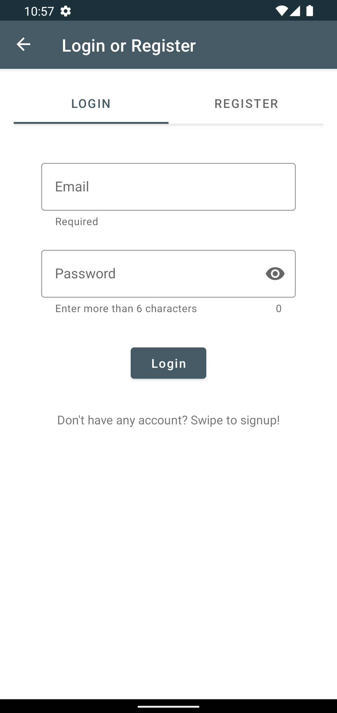
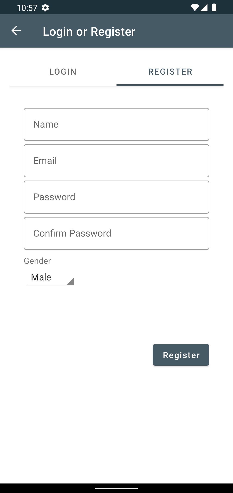
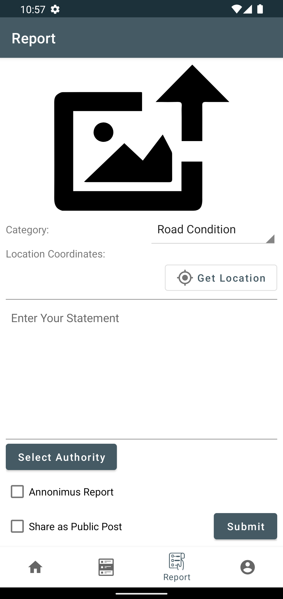
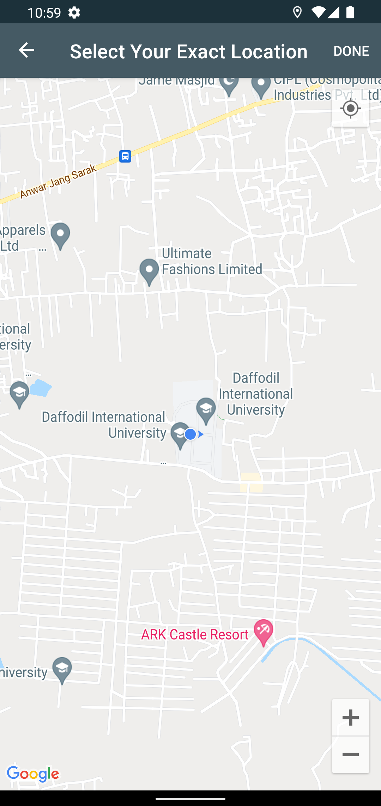

## Jonopod: A Smart Governance System

A prototype application for smart citizens and local governments in order to build effective communication between them.
Users can report about their surrounding problems,  
create their service profile if the are in govt service and this short profile will be available for all citizens to contact them.

### Technology I've used...
* Android SDK
* Firebase
* Glide
* Constraint Layout
* Google Map SDK
* MVVM

### Screens
###### Home Page

###### Login

###### Register

###### Report Page

###### Select Location From the Google Map

